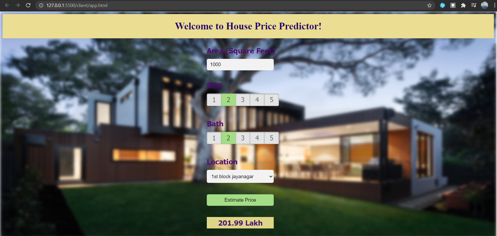

# House Price Predictor

This is a Machine Learning based project which uses Linear Regression Technique to predict Real Estate prices trained using Bengaluru House Prices Dataset.

## Installation

Using pip to install Flask

```bash
pip install flask
```

## Usage

Clone the repository on your local machine.
```bash
git clone https://github.com/avd151/House-Price-Predictor.git
```
Go to the directory containing the server.py file
```bash
cd House-Price-Predictor/server
```
Run python flask server
```bash
python server.py
```
Open the html file in a web browser, and enter the input fields to predict the price according to the details entered.

## Visuals


## Contributing
Pull requests are welcome. For major changes, please open an issue first to discuss what you would like to change.

Please make sure to update tests as appropriate.

## License
[MIT](https://choosealicense.com/licenses/mit/)
